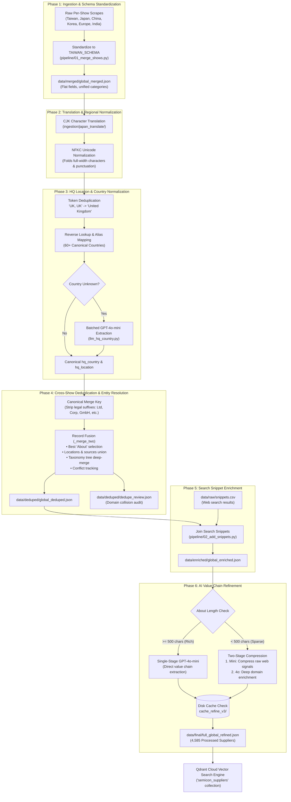

# Semiconductor Sourcing Data Processing Architecture

This document provides a comprehensive technical breakdown of the multi-stage **Data Processing & Entity Resolution Phase** implemented in **SEMICON Source Easy (v2)**. It details how disparate, noisy exhibitor directories across multiple global trade shows are scraped, standardized, translated, deduplicated, enriched with external intelligence, and refined via LLMs into a high-precision supplier catalogue.

---

## 1. Executive Summary & Problem Formulation

In industrial procurement, raw supplier catalogues obtained from event organizers (such as SEMI's per-expo exhibitor portals) suffer from severe data quality issues:

* **Regional Fragmentation:** SEMI operates decentralized exhibitions across Taiwan, Japan, China, Korea, Europe, and India. Each show maintains a separate web portal, category taxonomy, and data schema.
* **Lexical & Legal Variations:** The same global supplier exhibits under different names across shows (e.g., *"Advantest Co., Ltd."* in Taiwan, *"ADVANTEST CORPORATION"* in Japan, *"Advantest (Europe) GmbH"* in Munich).
* **Language Barriers:** Shows in Tokyo and Shanghai feature corporate overviews and locations written predominantly in Japanese (Kanji/Kana) and Simplified Chinese (Hanzi).
* **Missing & Dirty Geographic Data:** Headquarter locations are frequently submitted as unvalidated free text (*"Hsinchu, Taiwan"*, *"Tokyo, Japan"*, *"United Kingdom, United Kingdom"*, or left blank).
* **Low-Signal Descriptions:** Exhibitor *"About"* text is often either non-existent, marketing boilerplate (*"Leading global provider of innovative solutions..."*), or hyper-specialized fragments that omit the company's broader value chain positioning.

### The Objective
Transform raw, heterogeneous per-show scrapes into a single, canonical, English-standardized, deduplicated, and technically enriched dataset (`full-global-refined-hybrid.json`) ready for hybrid vector retrieval.

---

## 2. End-to-End Data Processing Pipeline



---

## 3. Detailed Processing Phases

### Phase 1: Ingestion & Schema Standardization
Each regional scraper outputs slightly different data shapes. For example, the India scraper returns nested arrays for `locations` and `sources`, while the Taiwan portal outputs flat strings.

* **Target Schema:** Enforced by `pipeline/01_merge_shows.py`:
  ```python
  TAIWAN_SCHEMA = {
      "company_name": "",       # Official exhibitor name
      "location": "",           # Show name (e.g., 'Taiwan 2026', 'Japan 2025')
      "ebooth_url": "",         # Direct link to official exhibitor booth
      "about": "",              # Self-submitted company description
      "hq_location": "",        # Raw headquarter string
      "hq_country": "",         # Standardized country
      "website": "",            # Official company URL
      "cat_l1_ids": [],         # Top-level taxonomy IDs
      "cat_l1_names": [],       # Top-level taxonomy names
      "cat_l2_ids": [],         # Leaf-level taxonomy IDs
      "cat_l2_names": [],       # Leaf-level taxonomy names
      "cat_tree": [],           # Nested hierarchical category structure
      "website_scrape": ""      # Scraped homepage text (if available)
  }
  ```
* **Structural Transformations:**
  1. **Nested Array Flattening:** Extracts `record["sources"][0]["ebooth_url"]` and `record["locations"][0]` for single-show consistency.
  2. **Type Coercion:** Ensures array fields default to empty lists `[]` rather than `null` to prevent downstream iteration errors.
  3. **Strict Validation:** Drops unmapped vendor-specific properties while logging discrepancies in a merge analysis report.

---

### Phase 2: Translation & Character Normalization
Exhibitor profiles from Asian expos frequently contain CJK (Chinese, Japanese, Korean) characters and full-width punctuation.

1. **Unicode NFKC Normalization:**
   Folds full-width CJK characters into their standard ASCII counterparts:
   $$\text{"，Ｌｔｄ．"} \longrightarrow \text{", Ltd."}$$
   $$\text{"（株）"} \longrightarrow \text{"(株)"}$$
2. **Translation Pipeline (`ingestion/japan_translate/`):**
   * Non-English text in `company_name`, `about`, and `hq_location` is exported to tabular format (`export_to_csv.py`).
   * Machine translation normalizes the descriptions into technical English while preserving proprietary product designations.
   * Translated fields are merged back into JSON (`import_translated.py`).

---

### Phase 3: HQ Location & Country Normalization
Accurate geographic filtering is critical for supply chain resilience and export control compliance. Free-text location strings are normalized into structured geographic entities.

#### 1. Token Deduplication (`dedupe_location`)
Scraped profiles often concatenate redundant location tokens:
$$\text{"United Kingdom, United Kingdom"} \longrightarrow \text{"United Kingdom"}$$
$$\text{"Hsinchu City, Taiwan, Taiwan"} \longrightarrow \text{"Hsinchu City, Taiwan"}$$

#### 2. Deterministic Alias Mapping (`normalize_country`)
Evaluates location tokens from right to left (where country names standardly appear), checking against an authoritative dictionary of 60+ countries and variations:
```python
KNOWN_COUNTRIES = {
    "taiwan": "Taiwan", "china": "China", "japan": "Japan", "korea": "South Korea",
    "south korea": "South Korea", "republic of korea": "South Korea",
    "usa": "United States", "u.s.a.": "United States", "united states": "United States",
    "germany": "Germany", "netherlands": "Netherlands", "the netherlands": "Netherlands",
    "united kingdom": "United Kingdom", "uk": "United Kingdom", "england": "United Kingdom",
    # ... 60+ countries mapped
}
```

#### 3. LLM Geographic Extraction Fallback (`llm_hq_country.py`)
For ambiguous, non-standard, or regional strings (e.g. *"Wonju-si, Gangwon-state"*, *"Bavaria"*, *"Kyoto Prefecture"*), unresolved locations are batched in groups of 50 and sent to `gpt-4o-mini` with strict JSON-mode schema prompting to resolve the sovereign nation.

* **Zero-Null Guarantee:** Any remaining unidentifiable country defaults to `"Unknown"` (rather than `None`/`null`), ensuring the supplier remains hard-filterable and never becomes silently invisible in the UI.

---

### Phase 4: Cross-Show Deduplication & Entity Resolution
Suppliers frequently exhibit across multiple SEMICON shows. Creating duplicate records creates competing search hits and fragments the supplier's footprint.

#### 1. Canonical Merge Key Generation (`normalise_name`)
To match suppliers reliably without false merges:
1. Normalize via Unicode NFKC and convert to lowercase.
2. Strip all punctuation: `.` `,` `(` `)` `[` `]` `{` `}` `'` `"`.
3. Standardize ampersands: `&` and `/` $\rightarrow$ ` and `.
4. Iteratively strip recognized **legal-entity suffixes** from the end of the string:
   ```python
   _LEGAL_SUFFIXES = [
       "incorporated", "corporation", "company", "limited", "co kg", "kabushiki kaisha",
       "sdn bhd", "pte ltd", "pvt ltd", "private limited", "s r l", "s p a", "s a",
       "b v", "n v", "a s", "a g", "gmbh co kg", "gmbh", "kk", "plc", "llp", "llc",
       "lp", "ag", "sa", "srl", "spa", "bv", "nv", "oy", "ab", "as", "kg", "inc", "corp", "co", "ltd"
   ]
   ```
   *Suffixes are sorted longest-first to ensure multi-word suffixes (like `co kg` or `gmbh co kg`) are stripped before lone single tokens (`co`, `kg`).*

> [!IMPORTANT]
> **Preserving Geographic Subsidiaries:** Geographic identifiers (`"ASML Korea"` vs. `"ASML Netherlands"`, `"Applied Materials Taiwan"`) are **deliberately preserved** and NOT stripped. Distinct legal subsidiaries maintain separate manufacturing sites, HQs, and local support teams and must not be merged.

#### 2. Record Fusion Rules (`_merge_two`)
When two records match on `normalise_name`:

| Field | Fusion Strategy | Rationale |
| :--- | :--- | :--- |
| **`about`** | Selects longest, non-fallback text via `_better_about()` | Replaces short generic placeholders with detailed technical overviews. |
| **`locations`** | Union of all unique show strings: `list(dict.fromkeys(base + other))` | Preserves complete global exhibition history (e.g., `["Taiwan 2026", "Japan 2025"]`). |
| **`sources`** | Concatenation of `[{location, ebooth_url}, ...]` | Allows buyers to jump directly to the supplier's booth profile at any show. |
| **`cat_tree`** | Deep recursive hierarchy merge | Unions category trees without duplicating Level 1 or Level 2 nodes. |
| **`hq_country`** | Discrepancy auditing (`hq_country_conflict`) | If Show A records "Japan" and Show B records "USA", keeps the first and logs both in `hq_country_conflict`. |
| **`website`** | Coalesce non-empty | Retains valid URLs across multi-show appearances. |

#### 3. Domain Collision Auditing (`dedupe_review.json`)
The pipeline extracts the bare domain (`website_domain(url)`) for all records. If two records share a domain but possess **different normalized names**, they are flagged into `dedupe_review.json` for human inspection rather than merged automatically.

---

### Phase 5: External Search Snippet Enrichment
Many specialized suppliers provide very sparse profiles on expo websites. To enrich the textual signal for vector embedding and LLM evaluation:

* **Snippet Ingestion (`pipeline/02_add_snippets.py`):**
  Matches each supplier to search engine snippets collected in `data/raw/snippets.csv`.
* **Column Shift Anomaly Recovery:**
  Detects and recovers 72 edge-case rows in the CSV where snippet text was shifted left into the `website` column due to unescaped delimiters.
* **Result:** Every record is enriched with a `"snippet"` field providing external market and technical context.

---

### Phase 6: AI-Powered Overview Refinement
The final transformation turns messy scraped text into structured procurement intelligence using OpenAI models (`pipeline/03_refine_overviews.py`).

#### 1. Dynamic Routing Architecture
* **Rich Profiles ($\ge 500$ chars):**
  Sent directly to `gpt-4o-mini`. The existing overview already contains sufficient technical signal; single-stage extraction is both fast and cost-effective.
* **Sparse Profiles ($< 500$ chars):**
  Subjected to a **Two-Stage Processing Pipeline**:
  1. *Stage 1 (Mini Compression):* `gpt-4o-mini` compresses all available hints (company name, category taxonomy, homepage text, search snippet) into a clean, dense 150-word semiconductor summary.
  2. *Stage 2 (4o Domain Enrichment):* `gpt-4o` evaluates the clean summary, applying deep domain knowledge to classify the company's precise positioning across the semiconductor value chain.

#### 2. Structured Intelligence Output
Every supplier profile is augmented with a structured `refined` block:
```json
{
  "refined": {
    "value_chain_position": "Front-End Equipment / Lithography",
    "semiconductor_relevance": "High",
    "summary": "ASML designs and manufactures advanced photolithography systems critical to semiconductor fabrication, specializing in extreme ultraviolet (EUV) and deep ultraviolet (DUV) immersion lithography systems.",
    "capabilities": [
      "EUV photolithography systems",
      "DUV immersion scanners",
      "YieldStar metrology and inspection",
      "Computational lithography software"
    ],
    "technical_expertise": [
      "Sub-5nm node patterning",
      "High-NA optics (0.55 NA)",
      "Multi-patterning alignment",
      "Wafer positioning interferometry"
    ],
    "end_markets": [
      "Leading-edge Logic (Foundry)",
      "DRAM Memory",
      "Advanced Packaging"
    ],
    "regional_presence": "Global (HQ in Veldhoven, Netherlands; major manufacturing and R&D in USA, Taiwan, South Korea, Japan)",
    "_status": "ok",
    "_model": "gpt-4o-mini",
    "_inferred_fields": 0
  }
}
```

#### 3. Reliability & Cost Controls
* **Content-Hashed Disk Caching:** Every LLM call computes an MD5 hash of input text stored in `refined_overview/cache_refine_v3/`. Subsequent pipeline re-runs skip previously processed records, making pipeline iterations **instant and free**.
* **Rate-Limiting & Backoff:** ThreadPool execution (default concurrency: 5) throttled with exponential backoff on HTTP 429/500 responses.

---

## 4. Dataset Evolution & Quality Metrics

The transformation of data volume across the processing lifecycle:

```
[Raw Show Portals]  ~6,000+ total raw exhibitor rows across 6 expos
       │
       ▼  (Phase 1: Schema Standardization)
[data/merged/global_merged.json]  5,240 standardized exhibitor rows
       │
       ▼  (Phase 3 & 4: Deduplication & Entity Resolution)
[data/deduped/global_deduped.json]  4,585 unique canonical companies (655 duplicate appearances resolved)
       │
       ▼  (Phase 5: Snippet Enrichment)
[data/enriched/global_enriched.json]  4,585 companies enriched with search snippets
       │
       ▼  (Phase 6: AI Value Chain Refinement)
[data/final/full_global_refined.json]  4,585 structured supplier profiles with complete intelligence blocks
```

### Key Dataset Quality Guarantees
1. **0% Broken Field Types:** All category arrays (`cat_l1_ids`, `cat_l2_ids`, `cat_tree`) guaranteed to be lists.
2. **0% Null Country Values:** 100% of records contain a non-null `hq_country` string for dependable faceted filtering.
3. **100% Traceability:** Merged companies preserve full exhibition history (`locations`) and direct links to original organizer profiles (`sources`).
4. **Dual Vector Ready:** Clean, unformatted text chunks formatted specifically for simultaneous MiniLM dense encoding and BM25 sparse tokenization.
