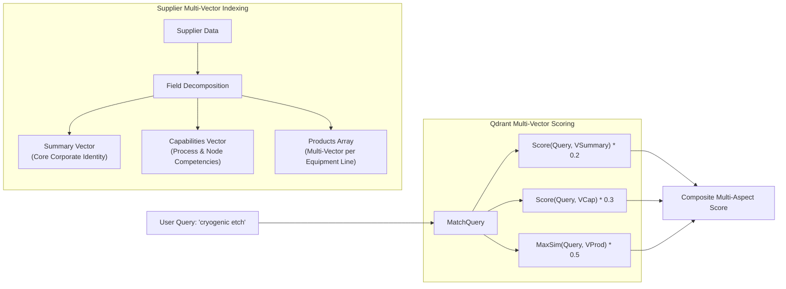
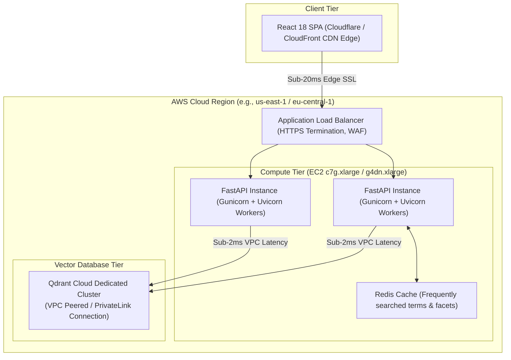
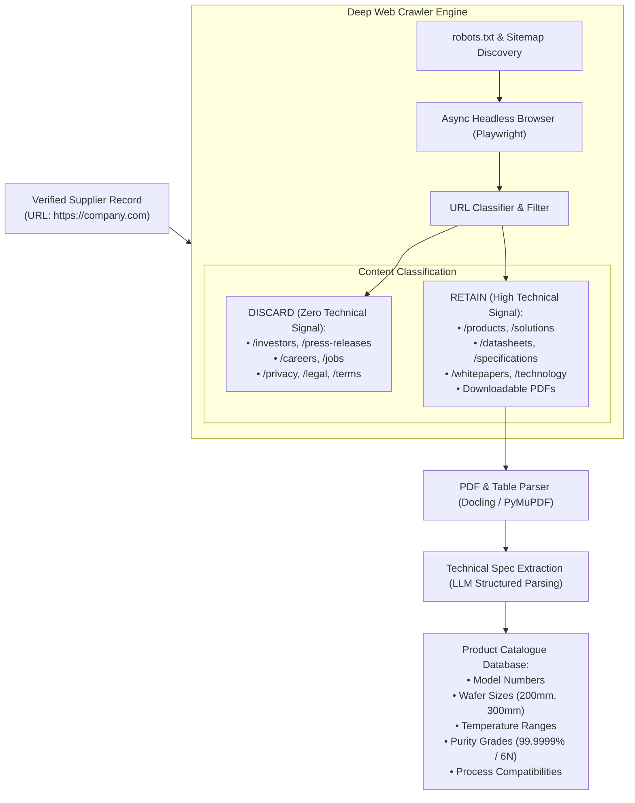
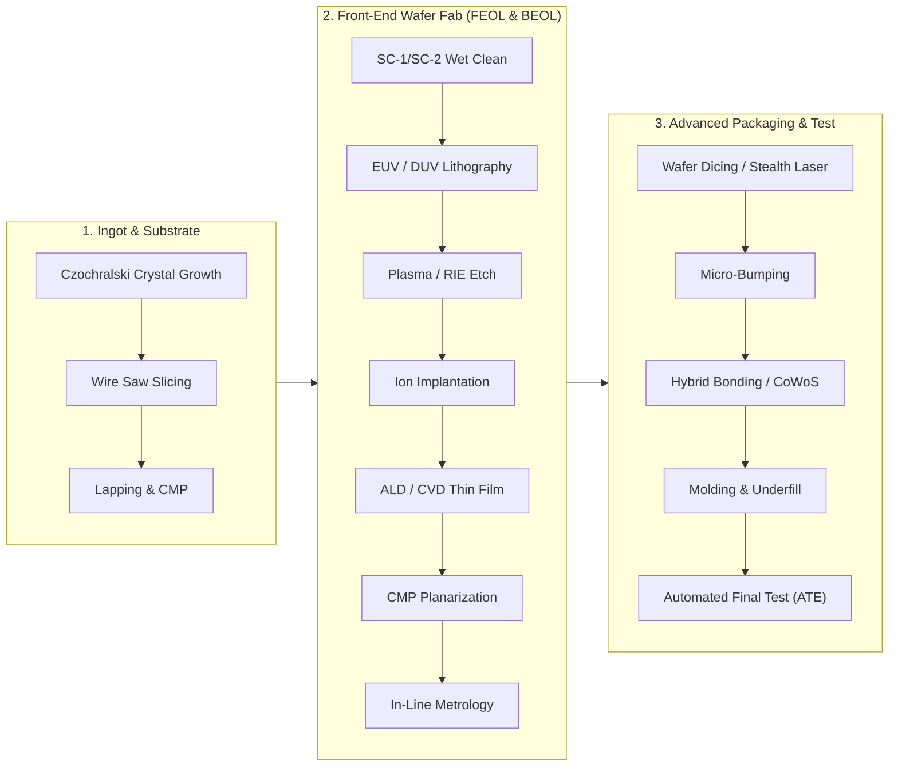

# Architectural Roadmap & Future Improvements

This document outlines the technical roadmap, architectural optimizations, and feature enhancements planned for future iterations of **SEMICON Source Easy**. It covers advanced vector retrieval paradigms, semantic category ontologies, deep catalogue crawling, cloud infrastructure scaling, and an interactive lifecycle-based supplier discovery interface.

---

## 1. Multi-Vector Embeddings & Late Interaction

### 1.1 The Limitation of Single-Vector Pooling
Currently, all supplier metadata (company name, overview, capabilities, and categories) is concatenated into a single text chunk and pooled into one 384-dimensional vector ($\mathbf{v} \in \mathbb{R}^{384}$). 

In semiconductor manufacturing, large conglomerates (e.g., Applied Materials, Tokyo Electron, Lam Research) offer hundreds of distinct products spanning etch, deposition, CMP, and metrology. **Mean-pooling compresses all these disparate capabilities into a single average coordinate**, diluting niche technical strengths. A query for *"sub-nanometer cryogenic atomic layer etch"* gets pulled toward the conglomerate's generic center of gravity rather than matching its specific cryogenic etch product line.

### 1.2 Multi-Vector Representations in Qdrant
Qdrant natively supports multiple named vectors per point:

```python
vectors_config={
    "summary": models.VectorParams(size=768, distance=models.Distance.COSINE),
    "capabilities": models.VectorParams(size=768, distance=models.Distance.COSINE),
    "products": models.VectorParams(size=768, distance=models.Distance.COSINE),
    "sparse": models.SparseVectorParams(),
}
```



### 1.3 ColBERT / Token-Level Late Interaction
For extreme precision on complex multi-term requirements, the system can adopt a late-interaction model like **ColBERTv2** or **Jina-ColBERT**:
* Instead of compressing the entire document into one vector, ColBERT stores a contextual vector for *every token*.
* Relevance is calculated using the **MaxSim** operator: for each query token, find the maximum cosine similarity across all document tokens, then sum:
  $$\text{Score}(Q, D) = \sum_{q \in Q} \max_{d \in D} \left( \mathbf{E}_q \cdot \mathbf{E}_d \right)$$
* Preserves fine-grained token alignments, preventing term erasure (e.g., ensuring `sub-5nm`, `cryogenic`, and `RIE` are all independently satisfied).

---

## 2. Standardized Semiconductor Category Taxonomy (Ontology-Driven Filtering)

### 2.1 The Current Problem
Current category tags originate from SEMI's regional trade show databases. These taxonomies suffer from:
* **Show Inconsistency:** Taiwan SEMICON uses one taxonomy hierarchy; Japan and Europe use legacy variations.
* **Redundancy:** Overlapping categories like *"Chemicals"* vs. *"Materials - Wet Chemicals"* vs. *"Electronic Specialty Gases"*.
* **Coarse Granularity:** Missing critical modern technology nodes (e.g., no dedicated categories for `EUV Pellicles`, `CoWoS Packaging`, `Glass Substrates`, or `High-NA Optics`).

### 2.2 Standardized Semiconductor Value Chain Taxonomy
Future versions will implement a normalized 3-tier ontology mapped during ingestion via LLM classification:

```mermaid
graph TD
    Root["Semiconductor Value Chain (Level 1)"]
    Root --> WFE["1.0 Wafer Fab Equipment (WFE)"]
    Root --> MAT["2.0 Materials & Chemicals"]
    Root --> BE["3.0 Packaging & Test (Backend)"]
    Root --> DES["4.0 Design, EDA & IP"]
    Root --> FAC["5.0 Facilities & Subsystems"]

    WFE --> WFE_Litho["1.1 Lithography (EUV, DUV, E-Beam, Nanoimprint)"]
    WFE --> WFE_Etch["1.2 Etch (Plasma, RIE, Cryogenic, Atomic Layer Etch)"]
    WFE --> WFE_Dep["1.3 Deposition (ALD, CVD, PVD, Epitaxy)"]
    WFE --> WFE_CMP["1.4 Planarization (CMP Tools, Slurry Delivery)"]
    WFE --> WFE_Metro["1.5 Metrology & Inspection (CD-SEM, Overlay, Ellipsometry)"]

    MAT --> MAT_Substrates["2.1 Wafers & Substrates (Bulk Silicon, SOI, SiC, GaN, Glass)"]
    MAT --> MAT_Photo["2.2 Photolithography Chemicals (Resists, BARC, Developers, Pellicles)"]
    MAT --> MAT_Gases["2.3 Ultra-High Purity (UHP) Gases & Precursors"]

    BE --> BE_AdvPkg["3.1 Advanced Packaging (2.5D/3D, CoWoS, Chiplets, Fan-Out, HBM)"]
    BE --> BE_Test["3.2 Automated Test Equipment (ATE, Probe Cards, Handlers)"]

    FAC --> FAC_Clean["4.1 Cleanroom Equipment & Air Filtration"]
    FAC --> FAC_Abate["4.2 Gas Abatement & Vacuum Pumps"]
```



### 2.3 Hierarchical Filtering Implementation
* **LLM Auto-Classification:** Every supplier is mapped to 1-3 primary Level 2/Level 3 leaf categories during Step 3 of the data pipeline.
* **Filter Guarantees:** Selecting a parent (e.g., `1.0 Wafer Fab Equipment`) dynamically cascades counts to all descendant leaves (`1.1 Lithography`, `1.2 Etch`, etc.) with zero unmapped records.

---

## 3. Granular Regional Presence & Fab Co-location Enrichment

### 3.1 The Need for Geographic Granularity
Currently, `hq_country` provides sovereign nation filtering, while `regional_presence` contains unstructured text. In semiconductor supply chains, procurement decisions depend on **operational proximity to major semiconductor manufacturing clusters**:
* Does an equipment vendor have local field service engineers near **TSMC Fab 18 (Tainan)** or **JASM (Kumamoto)**?
* Does a specialty gas supplier have distribution depots near **Intel Ocotillo (Arizona)** or **Silicon Saxony (Dresden)**?

### 3.2 Structured Geographic Intelligence Schema
Future pipeline iterations will extract a structured `geographic_footprint` array:

```json
{
  "geographic_footprint": {
    "global_hq": {
      "city": "Veldhoven",
      "country": "Netherlands",
      "coordinates": [51.404, 5.412]
    },
    "manufacturing_facilities": [
      { "location": "Wilton, CT, United States", "type": "Optical Modules" },
      { "location": "Tainan, Taiwan", "type": "EUV YieldStar & Training Center" }
    ],
    "rd_centers": [
      { "location": "San Diego, CA, United States", "focus": "Cymer EUV Light Sources" },
      { "location": "Hsinchu, Taiwan", "focus": "Computational Lithography" }
    ],
    "fab_co_locations": [
      "Hsinchu Science Park (Taiwan)",
      "Kumamoto / Kyushu Silicon Island (Japan)",
      "Pyeongtaek / Giheung (South Korea)",
      "Silicon Saxony / Dresden (Germany)"
    ]
  }
}
```

### 3.3 Qdrant Geo-Distance Querying
By storing coordinates in Qdrant payloads, buyers can execute **geo-radius filtering**:
```python
# Find suppliers with service infrastructure within 100km of TSMC Kumamoto Fab
models.FieldCondition(
    key="service_locations.geo",
    geo_radius=models.GeoRadius(
        center=models.GeoPoint(lat=32.883, lon=130.866),
        radius=100_000 # 100 km
    )
)
```

---

## 4. Infrastructure Scaling & Dedicated Cloud Deployment

### 4.1 Limitations of the Current Starter Deployment
The current deployment architecture on free/starter tiers (such as Render basic web services) exhibits inherent bottlenecks:
* **Cold Starts:** Free instances spin down after inactivity, causing a 30-50 second wake-up delay on initial access.
* **CPU Throttling on Embeddings:** Local FastEmbed execution (`all-MiniLM-L6-v2` and `Qdrant/bm25`) on shared vCPUs introduces 40-90ms query encoding latency.
* **Network Latency to Qdrant Cloud:** Cross-cloud network round-trips (Render $\rightarrow$ Qdrant Cloud cluster in AWS/GCP) introduce 60-120ms of pure HTTP TLS connection overhead per query.

### 4.2 Target Production Architecture (Dedicated AWS Instance)



### 4.3 Recommended Hardware Specs & Projected Latency

| Deployment Target | Specs | Encoding Latency | Network Latency to DB | Total Search Latency | Cost |
| :--- | :--- | :---: | :---: | :---: | :---: |
| **Current (Render Starter)** | 0.5 vCPU shared, 512MB RAM | ~60 ms | ~100 ms (cross-cloud) | **~180-250 ms** | $7 / mo |
| **Proposed AWS Compute (c7g.xlarge)** | 4 vCPU AWS Graviton3 (ARM NEON), 8GB RAM | **~8 ms** | **~2 ms (VPC Peered)** | **~18-25 ms** | ~$105 / mo |
| **GPU Accelerated (g4dn.xlarge)** | 4 vCPU, 16GB RAM, 1x NVIDIA T4 GPU (16GB VRAM) | **~3 ms** | **~2 ms (VPC Peered)** | **~10-15 ms** | ~$380 / mo |

---

## 5. Advanced Embedding Models & Domain Fine-Tuning

### 5.1 Evaluating Upgraded Embedding Models

While `all-MiniLM-L6-v2` is ultra-lightweight, several modern models offer vastly superior technical comprehension:

```mermaid
quadrantChart
    title Embedding Model Trade-Offs (Accuracy vs. Latency)
    x-axis Low Latency (Fast) --> High Latency (Slow)
    y-axis Lower Benchmark Accuracy --> Higher Benchmark Accuracy
    quadrant-1 High Accuracy / Heavy
    quadrant-2 Sweet Spot (Production Upgrade)
    quadrant-3 Lightweight / Legacy
    quadrant-4 Inefficient
    "all-MiniLM-L6-v2 (Current)": [0.15, 0.45]
    "bge-base-en-v1.5": [0.40, 0.82]
    "bge-m3": [0.65, 0.88]
    "text-embedding-3-small": [0.55, 0.80]
    "voyage-3": [0.60, 0.94]
    "Custom Triplet Fine-Tuned bge-base": [0.42, 0.96]
```

1. **`BAAI/bge-base-en-v1.5` (768 Dimensions):**
   * Highest performance-to-size ratio on the MTEB leaderboard.
   * Superior handling of complex technical specifications and multi-clause supplier capabilities.
2. **`BAAI/bge-m3` (1024 Dimensions):**
   * Multi-lingual native comprehension across English, Simplified Chinese, Traditional Chinese, Japanese, and Korean.
   * Eliminates the need for separate offline machine translation of Japanese/Chinese catalogues.
3. **`voyage-3` (Voyage AI):**
   * State-of-the-art domain retrieval engine optimized specifically for technical, legal, and financial queries.

### 5.2 Custom Contrastive Fine-Tuning (Hard-Negative Mining)
Generic off-the-shelf embedding models struggle with semiconductor terminology because models trained on general web text (Wikipedia, Reddit) treat related processes as equivalent.

We can fine-tune `bge-base` using **MultipleNegativesRankingLoss** on semiconductor procurement triplets:
* **Anchor ($A$):** *"sub-10nm immersion photolithography scanner"*
* **Positive ($P$):** *"ASML TWINSCAN NXT:1980Di DUV immersion lithography system for 300mm volume manufacturing down to sub-10nm nodes"*
* **Hard Negative 1 ($N_1$):** *"Nikon i-line stepper for 200mm mature node trailing-edge lithography"* *(same category, wrong node capability)*
* **Hard Negative 2 ($N_2$):** *"Applied Materials Centura reactive ion etch system"* *(adjacent front-end process, completely different equipment class)*

Fine-tuning on $\approx 5,000$ curated industrial triplets forces the latent space to dramatically separate specialized technical nodes that general models confuse.

---

## 6. Next-Generation Keyword Search: SPLADE & Domain Tokenization

### 6.1 Limitations of Standard BM25
Static BM25 operates on exact token matching:
* If a document says *"high-k metal gate (HKMG) atomic layer deposition"*, and a buyer searches for *"ALD dielectric precursor"*, BM25 scores only on the single overlapping word (`atomic` or `deposition`), missing the semantic link.

### 6.2 SPLADE (Sparse Lexical and Expansion Model)
SPLADE uses a Transformer model to output **dynamically expanded sparse vectors**:
* The model analyzes the input text and predicts weights not only for words present in the document, but also for **implicit technical synonyms and related components**:
  $$\text{Input: "EUV Pellicle"} \longrightarrow \text{Sparse Vector: } \{ \text{"pellicle"}: 4.2, \text{"euv"}: 3.9, \text{"transmittance"}: 2.7, \text{"carbon nanotube"}: 2.4, \text{"13.5nm"}: 2.1, \text{"asml"}: 1.8 \}$$
* Combines the **precision of sparse search** (exact part numbers, models, chemical codes) with the **expansion power of dense embeddings**, while executing via Qdrant's high-speed Inverted Index.

### 6.3 Specialized Semiconductor Tokenizer
Standard tokenizers split critical semiconductor notation:
* `sub-5nm` $\rightarrow$ `['sub', '5', 'nm']`
* `GaN-on-Si` $\rightarrow$ `['ga', '##n', 'on', 'si']`
* `SiC-MOSFET` $\rightarrow$ `['sic', 'mo', '##sf', '##et']`

A custom tokenizer with domain-preserved compounds ensures hyphenated chemistry, node names, and process acronyms are indexed as atomic lexical tokens.

---

## 7. Deep Catalogue Scraping & Technical Website Filtering

### 7.1 Beyond eBooth Portals: Recursive Corporate Crawling
Trade show exhibitor profiles provide only high-level summaries. The next phase will deploy an automated, deep web scraping engine that traverses suppliers' official websites:



### 7.2 What Deep Crawling Unlocks
* **Part-Number Search:** Searching for exact replacement components (e.g. *"MFC SEC-Z500X"* or *"O-ring Chemraz 513"*) matches actual downloadable equipment spec sheets.
* **Technical Parameter Filtering:** Filtering by hard physical attributes (e.g., wafer diameter: `300mm`, purity grade: `99.9999% (6N)`, temperature limit: `> 1200°C`).

---

## 8. Visual Lifecycle-Based Semiconductor Map & Interactive Discovery UI

### 8.1 The Sourcing Problem in Complex Manufacturing
Hardware procurement engineers rarely think in raw keyword search strings alone. Sourcing decisions follow the **physical progression of a silicon wafer through the fab and packaging line**.

A buyer tasked with establishing a new manufacturing line needs to ask:
*"Who are the qualified suppliers for every consecutive step in the advanced packaging process, from wafer bumping to thermal compression bonding and final burn-in?"*

### 8.2 Interactive Wafer Lifecycle Map



### 8.3 Interactive Visual Discovery Experience
In the React frontend, this process map will be rendered as an **interactive, zoomable SVG/Canvas lifecycle graph**:

1. **Visual Step Selection:** Clicking any node (e.g., `Hybrid Bonding / CoWoS` or `EUV / DUV Lithography`) instantly activates that specific value chain filter.
2. **Sub-Tier Equipment & Material Spiders:** Zooming into `Photolithography` reveals its dependent supply tiers:
   * Light Source Vendors (Excimer lasers, CO2 EUV drive lasers)
   * Optical Lenses & Mirrors (Zeiss High-NA optics)
   * Photoresist & Chemical Suppliers (Tokyo Ohka Kogyo, JSR, Shin-Etsu)
   * Pellicle & Mask Blank Manufacturers (Mitsui Chemicals, Hoya)
   * Track / Coater-Developer Systems (Tokyo Electron Clean Track)
3. **Supplier Card Carousel:** The right sidebar updates dynamically with pre-qualified suppliers matched directly to that physical fabrication stage.

---

## 9. Summary of Roadmap Priorities

| Phase | Milestone | Primary Technical Deliverable | Impact |
| :---: | :--- | :--- | :--- |
| **Q1** | **Standardized Category Ontology** | Hierarchical 3-tier L1/L2/L3 semiconductor value chain taxonomy with automated LLM classification. | Eliminates expo-dependent taxonomy fragmentation; guaranteed zero-dead-end faceted browsing. |
| **Q2** | **Infrastructure Migration (AWS)** | Dedicated AWS EC2 `c7g.xlarge` instance with VPC peering to Qdrant Cloud. | Eliminates cold starts; reduces end-to-end search latency from ~200ms to **< 25ms**. |
| **Q2** | **Upgraded Dense Embeddings** | Migration to `bge-base-en-v1.5` with contrastive triplet fine-tuning on semiconductor pairs. | Drastically improves technical precision on node numbers, proprietary alloys, and specialized processes. |
| **Q3** | **SPLADE & Domain Tokenizer** | Learned neural sparse expansion model + compound token preservation (`sub-5nm`, `GaN-on-Si`). | Bridges the lexical gap on technical synonyms without losing exact keyword precision. |
| **Q3** | **Structured Fab Footprint** | Extraction of manufacturing sites, R&D centers, and foundry co-locations with Qdrant geo-radius filtering. | Enables geographic resilience filtering (e.g. suppliers within 50km of Kumamoto or Dresden). |
| **Q4** | **Deep Catalogue Scraping** | Playwright recursive web crawler with PDF datasheet extraction and spec-sheet table parsing. | Enables exact part-number search, chemical purity filtering, and tolerance matching. |
| **Q4** | **Visual Lifecycle Map UI** | Interactive React/Canvas wafer manufacturing lifecycle discovery navigator. | Replaces flat keyword searching with an intuitive visual process flow for procurement engineers. |
