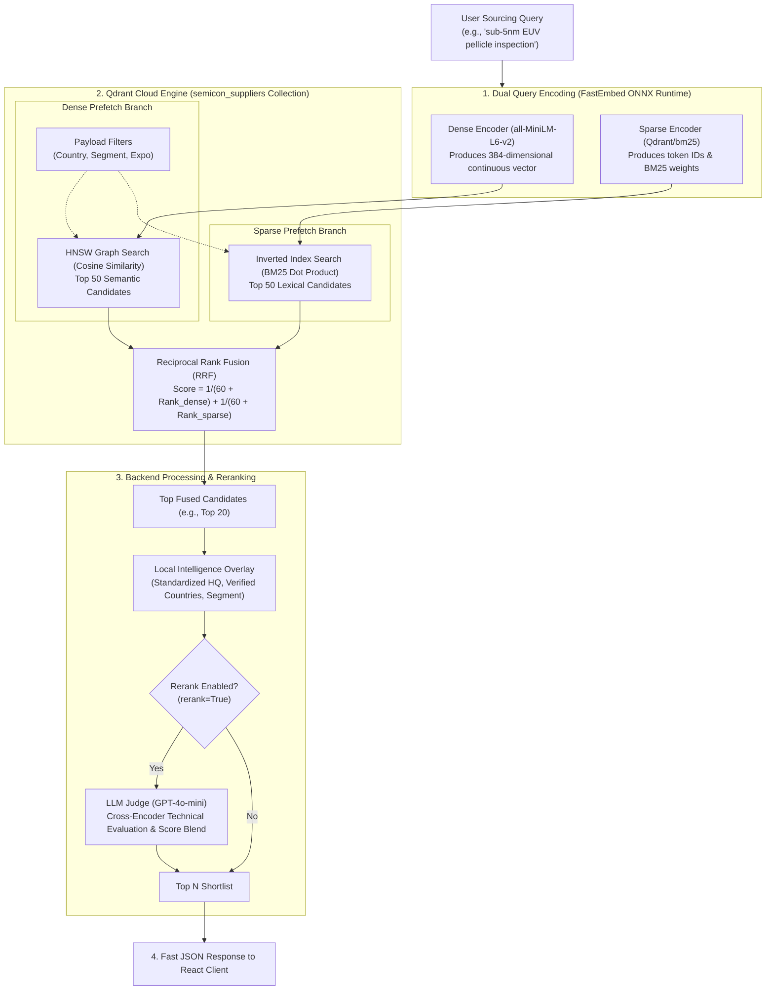

# Hybrid Search Architecture & Engineering Deep-Dive

This document provides a comprehensive technical breakdown of the hybrid retrieval architecture implemented in **SEMICON Source Easy (v2)**. It details how sparse (keyword) and dense (semantic) vectors are generated, indexed, and matched, evaluates alternatives and similarity metrics, and outlines the complete query lifecycle.

---

## 1. High-Level Architectural Overview

Pure keyword search (BM25) and pure semantic vector search each possess fatal failure modes when used alone in specialized industrial procurement:

* **The Problem with Pure Vector Search:** Dense embeddings project words into a shared semantic latent space. While excellent for broad conceptual matches, they frequently blur distinct technical entities. In semiconductor manufacturing, confusing `ArF` (193 nm deep-UV) with `KrF` (248 nm deep-UV) or `EUV` (13.5 nm extreme-UV) produces unacceptable results. Dense search can also fail on exact part numbers, specific chemical formulations (e.g. `TMAH`, `HCDS`), and brand names (`ASML`, `KLA`, `Tokyo Electron`).
* **The Problem with Pure Keyword Search:** BM25 relies strictly on lexical token overlap. If a buyer searches for *"wafer polishing chemicals"*, BM25 misses suppliers who describe themselves exclusively as *"chemical mechanical planarization (CMP) slurries"*.

### The Hybrid Solution
Our architecture implements **Two-Stage Hybrid Search**:
1. **Dense Retrieval (Semantic Meaning):** Captures synonyms, processes, and intent.
2. **Sparse Retrieval (Lexical Precision):** Guarantees exact matches on acronyms, chemistry names, and equipment models.
3. **Rank Fusion (RRF):** Fuses both candidate lists inside the vector engine into a single calibrated ranking without arbitrary score weighting.
4. **Local Enrichment & Optional LLM Reranking:** Overlays clean, authoritative company intelligence and applies a Cross-Encoder / LLM judge for complex technical qualification.



---

## 2. Sparse Vector Retrieval (Keyword Engine)

### 2.1 How Sparse Vectors are Created
* **Model:** `Qdrant/bm25` executed locally via `fastembed` (using ONNX runtime).
* **Generation Process:**
  1. The raw input chunk (company name, refined summary, capabilities, categories, overview) is passed through a specialized tokenizer.
  2. The tokenizer converts text to lowercase, strips punctuation, removes standard English stop words, and applies word stemming (e.g., *"manufacturing"*, *"manufactures"*, *"manufactured"* $\rightarrow$ *"manufactur"*).
  3. Every stemmed token maps to an integer index in a fixed vocabulary space.
  4. For each document $D$, the BM25 weight is computed for every term $t$:
     $$\text{Weight}(t, D) = \text{IDF}(t) \cdot \frac{f(t, D) \cdot (k_1 + 1)}{f(t, D) + k_1 \cdot \left(1 - b + b \cdot \frac{|D|}{\text{avgdl}}\right)}$$
     Where:
     * $f(t, D)$ is the term frequency of $t$ in document $D$.
     * $|D|$ is the document length, and $\text{avgdl}$ is the average document length across the collection.
     * $\text{IDF}(t)$ is the Inverse Document Frequency: $\ln\left(1 + \frac{N - n(t) + 0.5}{n(t) + 0.5}\right)$, penalizing ubiquitous words and heavily rewarding rare words (like `Pellicle` or `EUV`).
  5. The resulting sparse vector is stored as a tuple of parallel arrays containing only non-zero coordinates:
     ```json
     {
       "indices": [1042, 8931, 24105],
       "values": [2.84, 1.95, 3.42]
     }
     ```

### 2.2 Where and How it is Stored
* **Storage Location:** Stored directly in Qdrant Cloud inside the `semicon_suppliers` collection.
* **Qdrant Configuration:**
  ```python
  sparse_vectors_config={"sparse": models.SparseVectorParams()}
  ```
* **Internal Storage Data Structure:** Qdrant maintains an **In-Memory Inverted Index** for sparse vectors. For every unique token ID, Qdrant stores a sorted posting list of `(point_id, weight)`.

### 2.3 How Sparse Matching Works
When a user submits a query:
1. FastEmbed tokenizes the query into sparse tokens and computes query term weights $w_q(t)$.
2. Qdrant traverses the posting lists for only the tokens present in the query.
3. It accumulates the dot product between query weights and document weights:
   $$\text{Score}_{\text{sparse}}(Q, D) = \sum_{t \in Q \cap D} w_q(t) \cdot w_d(t)$$
4. The top $K$ documents (default 50) with the highest BM25 dot products are returned.

### 2.4 What Can Be Tweaked in Keyword / Sparse Search?

| Lever | How it Works | Impact on Semiconductor Sourcing |
| :--- | :--- | :--- |
| **BM25 $k_1$ Parameter** | Controls term frequency saturation. Higher values ($k_1 \approx 1.5 - 2.0$) reward documents mentioning a keyword repeatedly; lower values ($k_1 \approx 0.8 - 1.2$) treat 1 mention similarly to 5 mentions. | In technical directories, setting $k_1 \approx 1.2$ prevents suppliers with repetitive marketing fluff from ranking above concise, specialized manufacturers. |
| **BM25 $b$ Parameter** | Controls document length penalization ($0 \le b \le 1$). $b=1.0$ heavily penalizes long profiles; $b=0.0$ disables length normalization completely. | Setting $b \approx 0.75$ ensures broad conglomerate profiles with 1,000 words do not unfairly drown out specialized boutique suppliers with 100-word targeted overviews. |
| **Field Weighting / Boosting** | Duplicating or weighting specific fields during text chunking (e.g. `[Company Name] * 3`, `[Capabilities] * 2`, `[Overview] * 1`). | Ensures a direct company name or certified capability match always outranks a passing mention in an overview. |
| **Domain-Specific Stopword Filtering** | Removing high-frequency catalog boilerplate (*"supplier"*, *"leading provider"*, *"cutting-edge"*, *"global solutions"*). | Prevents noise words from inflating BM25 scores across thousands of exhibitor profiles. |
| **Acronym & Compound Preservation** | Custom regex tokenization to preserve hyphenated nodes and compound terms (`sub-5nm`, `high-NA`, `CMP-101`, `PECVD`). | Standard tokenizers often split `sub-5nm` into `sub` and `5nm`, losing critical search specificity. |
| **Learned Sparse Alternatives (SPLADE)** | Instead of static BM25, models like **SPLADE** (Sparse Lexical and Expansion Model) use a BERT mask to expand queries with synonyms directly into sparse token weights. | Automatically adds sparse weight for `lithography` when a user searches `stepper`, combining sparse speed with semantic expansion. |

---

## 3. Dense Vector Retrieval (Semantic Engine)

### 3.1 How Dense Vectors are Created
* **Model:** `sentence-transformers/all-MiniLM-L6-v2` via `fastembed` ONNX Runtime.
* **Architecture:** 6-layer Transformer with 22.7M parameters, producing a fixed **384-dimensional continuous vector space**.
* **Generation Process:**
  1. The backend builds a consolidated structured document via `_build_text_chunk(item)`:
     ```text
     ASML
     About: ASML is the global leader in semiconductor photolithography systems...
     Segment: Equipment
     Capabilities: EUV lithography systems; DUV immersion scanners; Metrology
     ```
  2. The input is tokenized with WordPiece and passed through MiniLM's multi-head self-attention layers.
  3. Mean pooling is applied over the contextual token representations to generate a single 384-dimensional vector:
     $$\mathbf{v} = [v_1, v_2, v_3, \dots, v_{384}], \quad v_i \in \mathbb{R}$$
  4. The vector is L2-normalized so that $\|\mathbf{v}\|_2 = 1.0$.

### 3.2 Where and How it is Stored
* **Storage Location:** Qdrant Cloud collection `semicon_suppliers` under vector name `"dense"`.
* **Configuration:**
  ```python
  vectors_config={
      "dense": models.VectorParams(
          size=384,
          distance=models.Distance.COSINE,
      )
  }
  ```
* **Internal Data Structure:** Qdrant constructs an **HNSW (Hierarchical Navigable Small World)** graph index:
  * Vectors are nodes in a multi-layer graph.
  * Higher layers have sparser connections for fast global traversal across vector space.
  * Lower layers have denser clustering for precision local search.
  * Query evaluation runs in $O(\log N)$ logarithmic time instead of $O(N)$ brute-force scanning.

### 3.3 Alternatives for Semantic Vector Embeddings

| Model / Provider | Dimensions | Pros | Cons / Trade-offs | Best For |
| :--- | :---: | :--- | :--- | :--- |
| **`all-MiniLM-L6-v2`** *(Current)* | **384** | **Extremely fast (15-30ms CPU)**, lightweight (90MB), runs anywhere with zero API costs or external dependencies. | Smaller capacity; can struggle with nuanced multi-hop technical reasoning. | **Production standard for high-throughput, low-latency microservices.** |
| **`BAAI/bge-base-en-v1.5`** | 768 | Substantially higher retrieval benchmarks (MTEB), strong domain generalization. | ~2x slower inference, ~4x larger RAM footprint. | Drop-in open-source upgrade when GPU acceleration is available. |
| **`BAAI/bge-m3`** | 1024 | Native multi-lingual, multi-aspect (dense, sparse, multi-vector in one model). | Heavyweight (~2GB model), higher latency on CPU. | Global portals requiring native Chinese/Japanese/Korean query understanding. |
| **OpenAI `text-embedding-3-small`** | 1536 (or 512 via Matryoshka) | Strong semantic performance, supports dimension scaling without retraining. | External API call latency (100-300ms network round-trip), recurring cost per token. | Cloud-native applications where local inference is not desired. |
| **Voyage AI (`voyage-3` / `voyage-law-2`)** | 1024 | State-of-the-art retrieval accuracy, specialized domain tokenizers. | Commercial API, vendor lock-in. | Enterprise systems prioritizing accuracy over air-gapped deployment. |

---

## 4. Similarity & Distance Metrics

### 4.1 Comparison of Vector Metrics

| Metric | Formula | Behavior | Suitability for Supplier Retrieval |
| :--- | :--- | :--- | :--- |
| **Cosine Similarity** *(Used Here)* | $\cos(\theta) = \frac{\mathbf{u} \cdot \mathbf{v}}{\|\mathbf{u}\|_2 \|\mathbf{v}\|_2}$ | Measures the **angle** between two vectors in multi-dimensional space, ignoring vector length. Range: $[-1, 1]$. | **Optimal.** Completely length-invariant. A 30-word profile matches a query just as accurately as a 500-word catalog. |
| **Dot Product (Inner Product)** | $\mathbf{u} \cdot \mathbf{v} = \sum_{i=1}^n u_i v_i$ | Measures both **angle and magnitude**. Equivalent to Cosine Similarity only if all vectors are strictly normalized to unit length. | Good if normalized; if unnormalized, it heavily biases toward longer texts with higher token density. |
| **Euclidean Distance (L2)** | $d(\mathbf{u}, \mathbf{v}) = \sqrt{\sum_{i=1}^n (u_i - v_i)^2}$ | Measures straight-line geometric distance. $0$ means identical; unbounded above. | Sensitive to vector magnitude. Documents of varying lengths can be artificially pushed apart. |
| **Manhattan Distance (L1)** | $d(\mathbf{u}, \mathbf{v}) = \sum_{i=1}^n \|u_i - v_i\|$ | Grid-based distance. | Rarely used for high-dimensional text embeddings; computationally slower than L2/Cosine on SIMD hardware. |

### 4.2 Why Cosine Similarity is Best for Our Use Case
In industrial supplier catalogues, exhibitor descriptions exhibit massive length variance:
* Supplier A submits a single sentence: *"Manufacturer of fluoropolymer tubing for high-purity wet chemical distribution."*
* Supplier B submits an entire corporate overview with 400 words detailing their history, ISO certifications, and secondary business units.

If Dot Product or Euclidean distance were used on unnormalized embeddings, Supplier B's vector magnitude would artificially dominate the retrieval scores. **Cosine similarity evaluates purely the direction of semantic intent**, allowing Supplier A's targeted sentence to score a near-perfect match for *"high purity fluoropolymer wet chemical tubing"*.

---

## 5. Rank Fusion: Combining Dense and Sparse

### 5.1 The Fusion Problem
Dense search produces cosine similarity scores in the range $[0.0, 1.0]$. Sparse BM25 search produces unbounded positive scores (often ranging from $0.5$ to $45.0+$ depending on collection size and term rarity). 

Directly adding or multiplying these raw scores is mathematically invalid without continuous re-calibration.

### 5.2 Reciprocal Rank Fusion (RRF)
Our engine uses **Reciprocal Rank Fusion (RRF)** directly executed inside Qdrant via `models.FusionQuery(fusion=models.Fusion.RRF)`:

$$\text{RRF Score}(d) = \sum_{m \in \{\text{dense}, \text{sparse}\}} \frac{1}{k + \text{rank}_m(d)}$$

Where:
* $\text{rank}_{\text{dense}}(d)$ is the document's position in the dense candidate list ($1, 2, 3, \dots$).
* $\text{rank}_{\text{sparse}}(d)$ is the document's position in the sparse candidate list ($1, 2, 3, \dots$).
* $k$ is a smoothing constant (standard default is $60$) that prevents top-ranked candidates from completely dwarfing candidates ranked slightly lower.

#### Why RRF Excels:
1. **Scale Agnostic:** Operates entirely on ordinal ranks rather than uncalibrated float values.
2. **Double-Hit Reward:** If a supplier ranks #2 in dense and #3 in sparse, its fused score compounds:
   $$\text{Score} = \frac{1}{60 + 2} + \frac{1}{60 + 3} = 0.0161 + 0.0158 = 0.0319$$
   This naturally elevates suppliers that satisfy both semantic intent and exact terminology above one-sided hits.
3. **Outlier Resistance:** A single extreme BM25 score cannot hijack the top position if the semantic model disagrees.

---

## 6. End-to-End Query Lifecycle

When a user executes a search in the UI, the following sequence takes place:

```text
[Client Web Browser]
       │  HTTP POST /api/search (q="CMP slurry", hq_countries=["Japan"], limit=10)
       ▼
[FastAPI Backend: backend/api.py]
       │  Calls SourcingSearchEngine.search()
       ▼
[Search Engine: backend/search_engine.py]
       │
       ├─► 1. Construct Payload Filter:
       │      models.Filter(must=[FieldCondition(key="hq_country", match="Japan")])
       │
       ├─► 2. FastEmbed Dual Encoding:
       │      Dense Vector  = MiniLM-L6-v2("CMP slurry")  --> [384 floats]
       │      Sparse Vector = BM25("CMP slurry")          --> {indices: [...], values: [...]}
       │
       ├─► 3. Atomic Qdrant query_points() Call:
       │      ├─► Prefetch 1: Dense HNSW top-50 (Cosine) constrained by Filter
       │      ├─► Prefetch 2: Sparse Inverted Index top-50 (BM25) constrained by Filter
       │      └─► FusionQuery: Reciprocal Rank Fusion combines top candidates
       │
       ├─► 4. Candidate Shaping & Intelligence Overlays:
       │      Overlays verified local intelligence from full-global-refined-hybrid.json
       │      (Clean standardized HQ country, zero CJK characters, structured capabilities)
       │
       ├─► 5. Optional LLM Reranking (rerank=True):
       │      GPT-4o-mini acts as Cross-Encoder Procurement Judge
       │      Final Score = α * Norm(LLM) + (1 - α) * Norm(Retrieval)
       │
       ▼
[JSON HTTP Response]
       │  { results: [...], count: 10, total: 42 }
       ▼
[React UI (ResultCard.jsx)]
       Renders interactive supplier cards, scores, badges, and booth links.
```

---

## 7. Key Architecture FAQ & Interview Questions

### Q1: Why are filters placed inside each prefetch branch rather than at the top-level FusionQuery?
In Qdrant, when executing a `FusionQuery`, top-level filters are applied *after* the individual prefetch branches execute. If 50 dense candidates and 50 sparse candidates are retrieved globally and then filtered for `Costa Rica`, all candidates might be discarded, resulting in an empty response even if Costa Rican suppliers exist in the dataset. Placing the filter **inside each prefetch branch** forces the HNSW and Inverted Index graph traversals to search strictly within the filtered subset, guaranteeing that `limit` matching candidates are retrieved.

### Q2: What is the difference between Stage 1 Hybrid Retrieval and Stage 2 LLM Reranking?
* **Stage 1 (Bi-Encoder / Dense + Sparse):** Evaluates query and documents separately. Documents are pre-embedded offline. Fast ($<25\text{ ms}$), searching across thousands of suppliers, but cannot model complex token interactions between query and document.
* **Stage 2 (Cross-Encoder / LLM Judge):** Concatenates query and document together into a single transformer prompt (`Buyer query: X, Supplier: Y`). Allows full multi-head cross-attention across every word in the query and document simultaneously. Highly accurate but computationally expensive; applied only to the top 20 candidates.

### Q3: How does the system handle zero-query browsing without wasting compute?
When a user filters by Country or Expo without entering search text (`query=""`), the system skips FastEmbed and vector fusion entirely. It routes directly to `client.scroll()` using Qdrant payload filters, alphabetizing and paging results instantly with zero embedding latency.

### Q4: How are Out-of-Vocabulary (OOV) terms handled?
* Dense embeddings handle OOV terms via WordPiece subword tokenization (e.g., splitting an unseen chemical name into recognizable morphemes).
* Sparse BM25 matches character n-grams and stemmed roots.
* Together, hybrid search ensures that novel trade names or typos still retrieve relevant suppliers.
